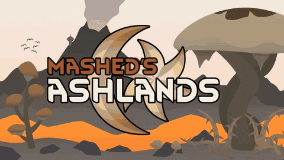
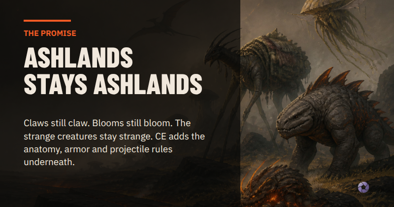
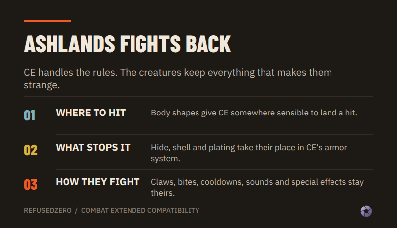
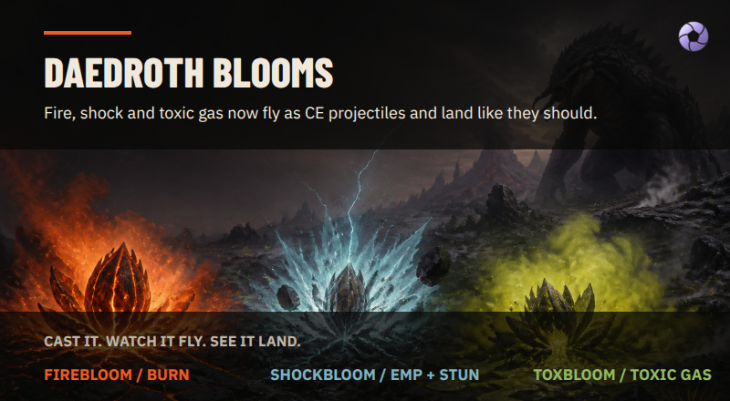
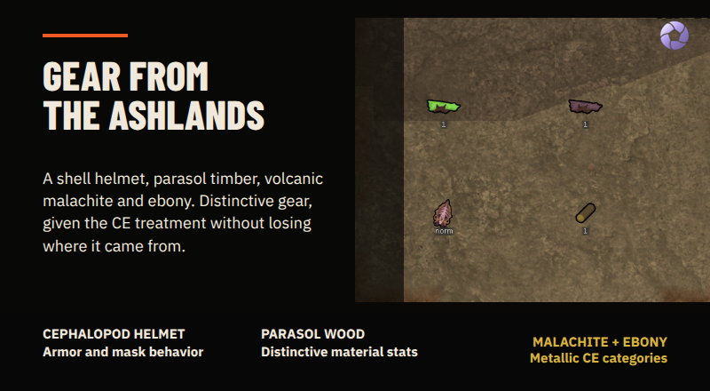
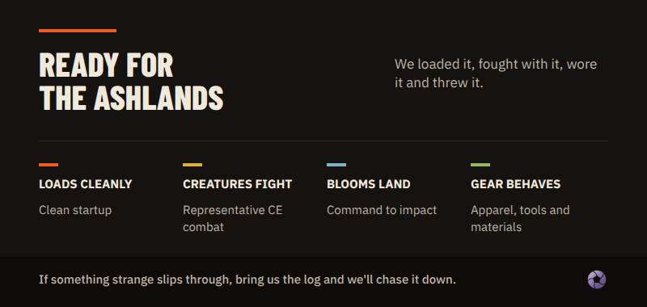
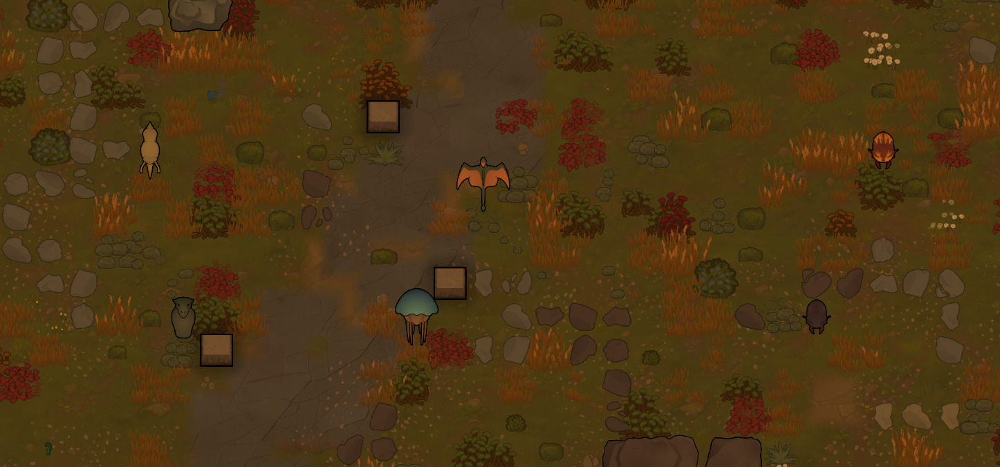
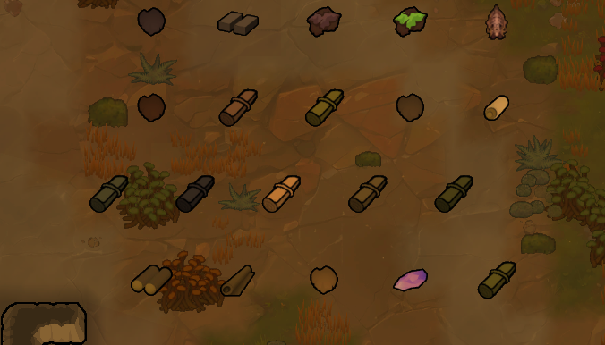

# Ashlands, meet Combat Extended

**RimWorld 1.6 | Version 1.0.0**

Mashed's Ashlands is weird in all the right ways: flying dinosaur looking nuisances, volcanic beasts, strange new materials, helmets for escaping toxic ash clouds, and Daedroths with weaponized gardening. This patch teaches Combat Extended how to handle all of this Morrowind awesomeness without sanding off what makes it fun.

## Creatures that fight like themselves

- 36 core races receive CE body shapes, natural armor, and CE-aware attacks.
- 11 Biotech and Odyssey variants join in only when their DLC content is active.
- Source attack labels, cooldowns, body groups, sounds, and special effects stay where they belong.

## Daedroth gardening, now CE-aware

Firebloom, Shockbloom, and Toxbloom travel through CE's projectile system while keeping their Ashlands identities and effects.

## Gear from the Ashlands

- 19 material and buildable definitions receive CE bulk, armor, and material behavior.
- The Cephalopod Helmet now works with CE's black smoke.
- Parasol wood remains a modest improvised melee option instead of becoming a surprise superweapon.

## Built carefully, tested by hitting things

We spawned the creatures, made them fight, fired the blooms, checked the DLC variants, inspected the gear, and followed the logs whenever something looked wrong. This mod went through exhaustive testing.

RimWorld mod lists are wonderfully unpredictable, so useful bug reports are always welcome. Please include **Player.log**, your active mod list and load order, the creature or item involved, and steps we can reproduce.

## You will need

- [Mashed's Ashlands](https://steamcommunity.com/sharedfiles/filedetails/?id=3109835541)
- [Combat Extended](https://steamcommunity.com/sharedfiles/filedetails/?id=2890901044)
- Biotech and Odyssey only for their corresponding Ashlands content

Load this patch after Mashed's Ashlands and Combat Extended.

## Source & support

Want to grab the mod or report something strange? [The Steam Workshop page is here.](https://steamcommunity.com/sharedfiles/filedetails/?id=3778867914)

## Credits

Mashed's Ashlands belongs to its original creators. Combat Extended belongs to the Combat Extended team. This external compatibility patch is by **refusedzero**.

Support your local modders and go endorse these incredibly talented people.
